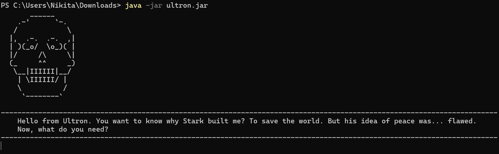
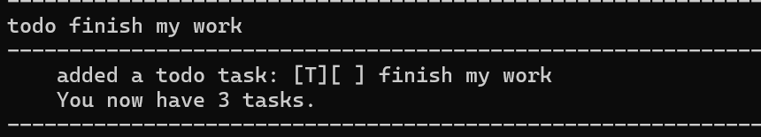
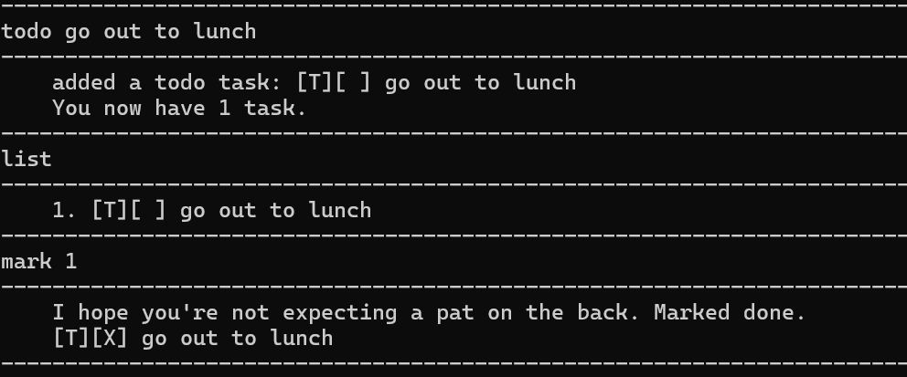
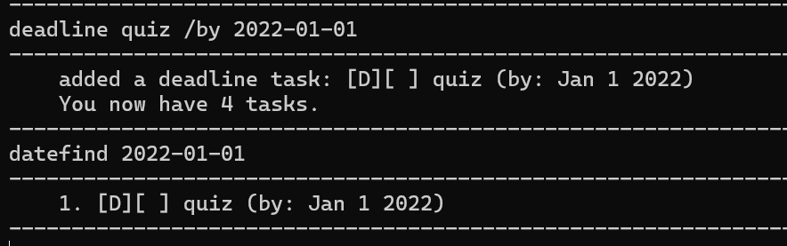
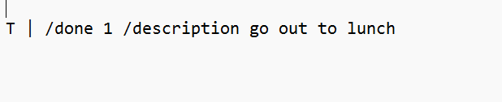

# Ultron User Guide 🤖

Ultron is a ***command line interface chatbot*** which helps manage, organize and track tasks for the user through an 
interactive and uniquely personalized interface that mimics the Avengers character named Ultron (an artifical intelligence
robot built by Tony Stark that ultimately goes rogue). 
## Table of Contents

<!-- TOC -->
  * [Quick Start](#quick-start)
  * [Features](#features-)
    * [Listing all tasks: `list`](#listing-all-tasks-list)
    * [Adding simple to-do tasks: `todo`](#adding-simple-to-do-tasks-todo)
    * [Adding deadline tasks: `deadline`](#adding-deadline-tasks-deadline)
    * [Adding event tasks: `event`](#adding-event-tasks-event)
    * [Marking a task as completed: `mark`](#marking-a-task-as-completed-mark)
    * [Unmarking a task as not done: `unmark`](#unmarking-a-task-as-not-done-unmark)
    * [Deleting a task `delete`](#deleting-a-task-delete)
    * [Finding a task `find`](#finding-a-task-find)
    * [Finding a task `datefind`](#finding-a-task-datefind)
    * [Exit `bye`](#exit-bye)
  * [Saving the data](#saving-the-data)
  * [Editing the data file](#editing-the-data-file)
  * [Known issues](#known-issues)
  * [Command Summary](#command-summary)
<!-- TOC -->

## Quick Start

1. Ensure you have **Java 17** or above installed in your Computer and it is compatible with your device operating system (Mac or Windows).

2. Download the latest `.jar` file from nmarwah7/ip repository under latest release.

3. Copy the file to the folder you want to use as the home folder for Ultron.

4. Open a command terminal, `cd` into the folder you put the jar file in, and use the  `java -jar ultron.jar` command to run the application.
Ultron should appear in your terminal window as shown below. Note the app will generate a data.txt file in this home folder which
will be empty when the app is first launched.
   
5. Type the command in the terminal window and press Enter to execute it. e.g. typing list and pressing Enter will list all stored tasks.
Some example commands you can try:

   `list` : Lists all tasks.

    `todo finish my work`  : Adds a task you have to do with a brief description.

    `delete 3 `: Deletes the 3rd task shown in the current list.

    `deadline assignment /by 2023-01-11` : Adds a task you have to do that involves a deadline with a brief description and due by date in _YYYY-MM-DD format_.

    `bye` : Exits the app.

Refer to the Features below for details of each command.

## Features 
### Listing all tasks: `list`
Shows a list of all tasks stored by Ultron.

_**Format**_: `list`

### Adding simple to-do tasks: `todo`
Adds a simple task you have to do with a description.

_**Format**_: `todo <description>`

_**Example**_: `todo finish my work`

### Adding deadline tasks: `deadline`
Adds a deadline task you have to do with a description and a due by date.

_**Format**_: `deadline <description> /by <YYYY-MM-DD>`

_**Example**_: `deadline assignment /by 2023-01-11`

### Adding event tasks: `event`
Adds an event task you have to do with a description and a time frame.

_**Format**_: `event <description> /from <some time> /to <some time>`

_**Example**_: `event open house /from monday /to friday`

### Marking a task as completed: `mark`
Marks a task in the list as completed (denoted by an X next to the task description).

-Edits the task at the specified list_index. The index refers to the index number shown in the displayed task list. The index must be a positive integer 1, 2, 3, …
and must correspond to an existing task in the list.

_**Format**_: `mark <list_index>`

_**Example**_: `mark 1`

### Unmarking a task as not done: `unmark`
Unmarks a completed task in the list as not completed.

-Edits the task at the specified list_index. The index refers to the index number shown in the displayed task list. The index must be a positive integer 1, 2, 3, …
and must correspond to an existing task in the list.

_**Format**_: `unmark <list_index>`

### Deleting a task `delete`
Deletes a task in the list.

-Deletes the task at the specified list_index. The index refers to the index number shown in the displayed task list. The index must be a positive integer 1, 2, 3, …
and must correspond to an existing task in the list.

_**Format**_: `delete <list_index>`

### Finding a task `find`
Finds tasks whose names contain any of the given keywords.
-Note: the keyword is case-sensitive.

_**Format**_: `find <keyword>`

_**Example**_: `find assigment`

### Filtering a task by date `datefind`
Finds deadline tasks on a particular date.
-Note: the date format must be of YYY-MM-DD.
_**Format**_: `datefind <YYY-MM-DD>`

_**Example**_: `datefind 2023-01-01`

### Exit `bye`
Exits the program.

_**Format**_: `bye`

## Saving the data
Ultron task data is saved in the hard disk automatically after any command that changes the data. There is no need to save manually.

## Editing the data file

Ultron task data is saved automatically as a .txt file [JAR file location]/data/data.txt. Advanced users are welcome to update data directly by editing that data file.

> CAUTION!:
> The data file has particular formatting, any change to this file that violates this formatting could **corrupt the data** and would require the data file to be deleted
and started again. Therefore, edit the data file only if you are confident that you can update it correctly.

## Known issues
1. If you would like to enter a deadline due by date, you cannot enter any format other than YYYY-MM-DD due to how the program stores and displays
this date back to this user. However, event time frame is more flexible and there is no need to follow this time format in the `/from <time> /to <time>`
command parameters.
2. The paramters `/from` or `/to`, for example, include a forward **not** a backward slash.

## Command Summary
<table>
  <tr>
    <th>Action</th>
    <th>Format, Examples</th>
  </tr>
  <tr>
    <td><b>Todo</b></td>
    <td><code>todo &lt;description&gt;</code> e.g., <code>todo some work</code></td>
  </tr>
  <tr>
    <td><b>Deadline</b></td>
    <td><code>deadline &lt;description&gt; /by &lt;YYYY-MM-DD&gt;</code> e.g., <code>deadline work /by 2023-01-01</code></td>
  </tr>
  <tr>
    <td><b>Event</b></td>
    <td><code>event &lt;description&gt; /from &lt;some time&gt; /to &lt;some time&gt;</code> e.g., <code>event open house /from monday /to friday</code></td>
  </tr>
  <tr>
    <td><b>Mark</b></td>
    <td><code>mark &lt;index&gt;</code> e.g., <code>mark 1</code></td>
  </tr>
  <tr>
    <td><b>Delete</b></td>
    <td><code>delete &lt;index&gt;</code> e.g., <code>delete 3</code></td>
  </tr>
  <tr>
    <td><b>Unmark</b></td>
    <td><code>unmark &lt;index&gt;</code> e.g., <code>unmark 1</code></td>
  </tr>
  <tr>
    <td><b>Find</b></td>
    <td><code>find &lt;keyword&gt;</code> e.g., <code>find assignment</code></td>
  </tr>
  <tr>
    <td><b>Date Find</b></td>
    <td><code>datefind &lt;YYYY-MM-DD&gt;</code> e.g., <code>datefind 2023-01-01</code></td>
  </tr>
  <tr>
    <td><b>List</b></td>
    <td><code>list</code></td>
  </tr>
  <tr>
    <td><b>Exit</b></td>
    <td><code>bye</code></td>
  </tr>
</table>

